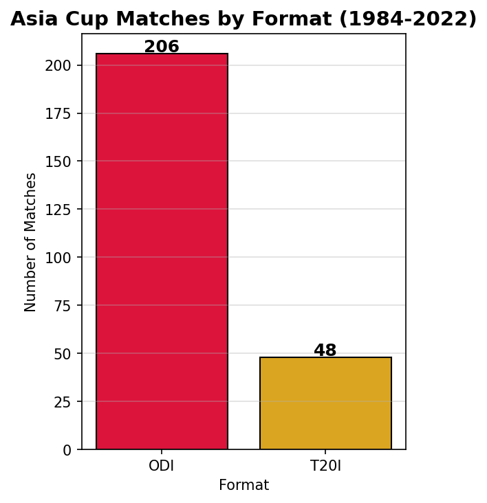
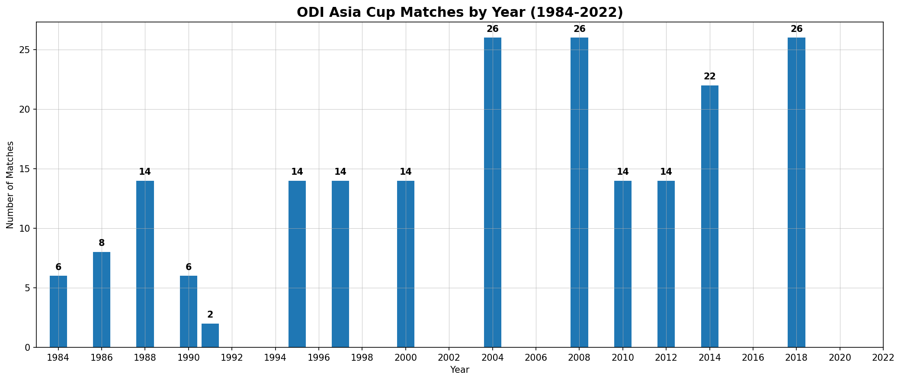
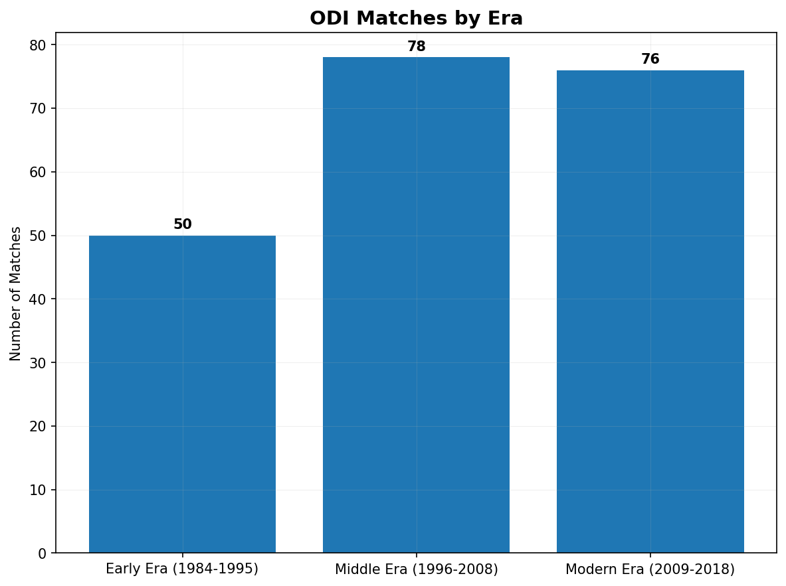
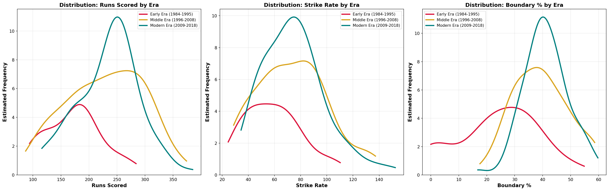
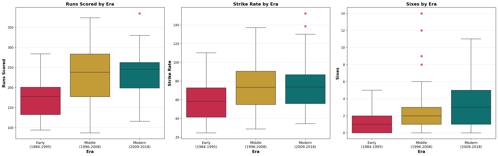

# 🏏 Asia Cup Cricket Analysis (1984–2022)

An exploratory data analysis of Asia Cup cricket matches spanning nearly four decades, examining how the game has evolved across formats, eras, and key performance metrics.

---

## 🎯 Project Objective

The goal of this project is to analyze historical Asia Cup cricket data to identify trends in match frequency, scoring patterns, and batting performance across different eras and formats using exploratory data analysis techniques.

---

## 📁 Project Structure

```
├── data/
│   ├── asiacup.csv
│   ├── batsman data odi.csv
│   ├── batsman data t20i.csv
│   ├── bowler data odi.csv
│   ├── bowler data t20i.csv
│   ├── wicketkeeper data odi.csv
│   ├── wicketkeeper data t20i.csv
│   └── champion.csv
├── notebooks/
│   └── NotebookDataPreparationAndMatchAnalysis.ipynb
├── images/
│   ├── graph_01.png
│   ├── graph_02.png
│   ├── graph_03.png
│   ├── graph_04.png
│   └── graph_05.png
└── README.md
```

---

## 📥 Data Source

All datasets were sourced from [Kaggle — Asia Cup Cricket (1984 to 2022)](https://www.kaggle.com/datasets/hasibalmuzdadid/asia-cup-cricket-1984-to-2022), compiled into structured CSV files covering match results, batting statistics, bowling statistics, and tournament outcomes.

Data cleaning and preprocessing were performed using Pandas. Note that while the dataset covers tournaments up to 2022, the player-level statistical data (batting, bowling, wicketkeeping) extends through the 2018 tournament, which is reflected in the era-based analysis.

---

## 📊 Analysis Overview

### Format Distribution

ODI has dominated the Asia Cup with **206 matches** compared to **48 T20I matches**, reflecting the tournament's historical roots in the 50-over format. T20I matches began appearing from 2016 onward as the format gained global popularity, and remain a smaller portion of the overall dataset.

---

### ODI Matches by Year

Match counts grew significantly from the mid-2000s onward, with 2004, 2008, and 2018 each reaching a peak of **26 matches** — driven by expanded team participation and round-robin formats.

---

### ODI Matches by Era

The analysis splits matches into three eras: **Early (1984–1995)**, **Middle (1996–2008)**, and **Modern (2009–2018)**. Era definitions were chosen based on major structural and gameplay shifts, including expansion of participating teams, changes in tournament frequency, and the introduction of modern aggressive batting approaches. The Middle and Modern eras saw significantly more matches, with 78 and 76 respectively vs just 50 in the Early era.

---

### Performance Distributions by Era (KDE)

Kernel density plots reveal how runs scored, strike rate, and boundary percentage have shifted across eras. The Modern Era shows a tighter, higher distribution — suggesting increased scoring consistency and higher run rates in the modern era.

---

### Batting Metrics by Era (Box Plots)

Box plots confirm the trend: the **Modern Era** has the highest median runs (246) with a tighter IQR (64), while the **Middle Era** shows the most volatility. Sixes have increased steadily across all three eras.

---

## 🛠️ Tech Stack

- **Python**
- **Pandas** — data wrangling
- **Matplotlib** — visualisation
- **Seaborn** — statistical plots
- **Jupyter Notebook**

---

## 🚀 Getting Started

1. Clone the repository:
   ```bash
   git clone https://github.com/SarimKhalil/asia-cup-analysis.git
   cd asia-cup-analysis
   ```

2. Install dependencies:
   ```bash
   pip install pandas matplotlib seaborn jupyter
   ```

3. Launch the notebook:
   ```bash
   jupyter notebook notebooks/NotebookDataPreparationAndMatchAnalysis.ipynb
   ```

---

## 📌 Key Findings

- ODI, historically, remains the dominant Asia Cup format with 4x more matches than T20I
- T20I matches were introduced to the Asia Cup from 2016 onward and remain a smaller portion of the tournament
- Match frequency grew significantly post-2000 due to tournament expansion
- The Modern Era (2009–2018) shows higher, more consistent scoring with greater boundary hitting
- The Middle Era was the most volatile period for batting performance
- Sixes have increased steadily across all eras, reflecting the evolution of aggressive batting

---

## ⚠️ Limitations

- Player-level statistical analysis is limited to ODI data up to 2018; the 2022 tournament is reflected in match-level data only
- Contextual factors such as pitch conditions, rule changes, and team strength were not included
- Some tournaments had fewer matches, which may affect era comparisons
- T20I data is limited due to its recent introduction in the Asia Cup
